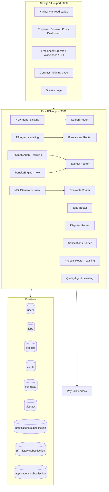

# Design Document: platform-core

## Overview

platform-core delivers five foundational pillars on top of the existing FastAPI + Next.js + Firestore stack:

1. **AI Freelancer Search** — NLP-powered ranked profile discovery
2. **Job Board** — Job posting CRUD and application lifecycle
3. **PFI Engine** — Score computation, history persistence, and feedback ingestion
4. **Escrow Vault** — Full UNFUNDED → FUNDED → CLOSED lifecycle with PayPal, delay penalties, and dispute resolution
5. **MOU / Signing** — Contract generation from milestones, digital signing, and notifications

The existing codebase already has: `PFIAgent`, `SmartEscrowAgent`, `PaymentAgent` (in-memory `EscrowVault`), `NLPAgent`, `QualityAgent`, PayPal order/capture/payout wiring, and partial Firestore persistence via `FirebaseDB`. This design extends and wires those pieces end-to-end without replacing working logic.

---

## Architecture



### Key Design Decisions

- **Routers over monolithic main.py**: New endpoints are added as FastAPI `APIRouter` modules and included in `main.py` to keep the file manageable.
- **Firestore as source of truth**: All new collections are persisted to Firestore; the existing in-memory fallback pattern is retained for local dev without credentials.
- **PayPal for real money movement**: Vault funding uses PayPal order/capture (already wired). Milestone payouts use PayPal Payouts API (already partially wired in `paypal_service.py`). Dispute refunds use PayPal Refunds API.
- **Notifications are write-only from backend**: The frontend reads the `notifications` subcollection directly from Firestore via the client SDK for real-time badge updates, avoiding polling.
- **MOU generation is template-based with optional LLM enrichment**: A deterministic Jinja2-style template produces the contract; if `OPENAI_API_KEY` is present the LLM can enrich the scope-of-work prose.

---

## Components and Interfaces

### Backend Routers (new files)

| File | Prefix | Responsibility |
|---|---|---|
| `routers/search.py` | `/api/freelancers` | NLP search, profile list |
| `routers/jobs.py` | `/api/jobs` | Job CRUD, applications |
| `routers/freelancers.py` | `/api/freelancers` | Profile CRUD, PFI history |
| `routers/escrow.py` | `/api/escrow` | Vault lifecycle, release, penalty |
| `routers/contracts.py` | `/api/contracts` | MOU generation, signing |
| `routers/disputes.py` | `/api/disputes` | Dispute CRUD, resolution |
| `routers/notifications.py` | `/api/users` | Notification read/mark-read |

### New Backend Services

**`services/mou_generator.py`** — `MOUGenerator`
- `generate(project_id) -> ContractDoc`: fetches project + milestones from Firestore, fills template, persists to `contracts` collection.
- `render_text(contract_doc) -> str`: returns plain-text version.

**`services/penalty_engine.py`** — `PenaltyEngine`
- `compute_penalty(payment_amount, days_late) -> (rate, amount)`: pure function, returns penalty rate and deducted amount.
- `apply_penalty(vault_id, milestone_id, days_late)`: calls `compute_penalty`, writes `PENALTY` transaction to vault, triggers PFI update, writes notification.

**`services/notification_service.py`** — `NotificationService`
- `send(user_id, event_type, message, metadata)`: writes to `users/{user_id}/notifications`.

### Frontend Additions

| Page / Component | Change |
|---|---|
| `Navbar.tsx` | Add unread-count badge via Firestore `onSnapshot` on `notifications` subcollection |
| `employer/jobs/page.tsx` | New: job posting form + list |
| `employer/jobs/[jobId]/page.tsx` | New: view applications, accept/reject |
| `freelancer/browse/page.tsx` | Extend: NLP search bar wired to `GET /api/freelancers/search` |
| `freelancer/profile/page.tsx` | Extend: completeness meter, availability toggle |
| `contracts/[contractId]/page.tsx` | New: view MOU, sign button |
| `disputes/page.tsx` | New: raise dispute form |
| `employer/dashboard/[projectId]/page.tsx` | Extend: escrow status, penalty history |

### API Endpoints Summary

```
# Freelancer Search & Profiles
GET  /api/freelancers/search?q={query}
GET  /api/freelancers
GET  /api/freelancers/{id}/profile
PUT  /api/freelancers/{id}/profile
GET  /api/freelancers/{id}/pfi/history

# Jobs & Applications
POST /api/jobs
GET  /api/jobs
GET  /api/jobs/{job_id}
POST /api/jobs/{job_id}/apply
GET  /api/jobs/{job_id}/applications
PATCH /api/jobs/{job_id}/applications/{app_id}

# Escrow Vault
GET  /api/escrow/vault/{vault_id}
POST /api/escrow/vault/{vault_id}/fund
POST /api/escrow/vault/{vault_id}/release
POST /api/escrow/vault/{vault_id}/penalty

# Disputes
POST /api/disputes
GET  /api/disputes?project_id={id}
PATCH /api/disputes/{dispute_id}

# Contracts
POST /api/contracts/generate
GET  /api/contracts/{contract_id}
POST /api/contracts/{contract_id}/sign
GET  /api/contracts/{contract_id}/signatures

# Notifications
GET  /api/users/{user_id}/notifications
PATCH /api/users/{user_id}/notifications/{notif_id}

# Feedback → PFI
POST /api/projects/{project_id}/feedback
```

---

## Data Models

### Firestore Collections

#### `users/{userId}` (extended)
```json
{
  "id": "string",
  "name": "string",
  "email": "string",
  "role": "employer | freelancer",
  "skills": ["string"],
  "bio": "string",
  "hourly_rate": 0.0,
  "availability": true,
  "portfolio_url": "string",
  "pfi_score": 500,
  "profile_completeness": 0,
  "restricted": false,
  "paypal_email": "string",
  "paypal_connected": false,
  "created_at": "ISO8601",
  "updated_at": "ISO8601"
}
```

#### `users/{userId}/notifications/{notifId}`
```json
{
  "id": "string",
  "event_type": "MILESTONE_SUBMITTED | MILESTONE_APPROVED | MILESTONE_REJECTED | PAYMENT_RELEASED | PENALTY_APPLIED | DISPUTE_OPENED | DISPUTE_RESOLVED | CONTRACT_SIGNED | CONTRACT_EXECUTED",
  "message": "string",
  "read": false,
  "metadata": {},
  "created_at": "ISO8601"
}
```

#### `users/{userId}/pfi_history/{entryId}`
```json
{
  "project_id": "string",
  "milestone_id": "string",
  "previous_score": 500,
  "new_score": 520,
  "score_change": 20,
  "component_breakdown": {
    "quality": 85,
    "deadline": 100,
    "revision_rate": 90,
    "completion": 80
  },
  "recorded_at": "ISO8601"
}
```

#### `jobs/{jobId}`
```json
{
  "id": "string",
  "employer_id": "string",
  "title": "string",
  "description": "string",
  "required_skills": ["string"],
  "budget_min": 0.0,
  "budget_max": 0.0,
  "timeline_days": 30,
  "status": "OPEN | FILLED | CLOSED",
  "created_at": "ISO8601"
}
```

#### `jobs/{jobId}/applications/{appId}`
```json
{
  "id": "string",
  "job_id": "string",
  "freelancer_id": "string",
  "cover_note": "string",
  "status": "PENDING | ACCEPTED | REJECTED",
  "pfi_score_at_apply": 500,
  "created_at": "ISO8601"
}
```

#### `vaults/{vaultId}` (extended from existing)
```json
{
  "vault_id": "string",
  "project_id": "string",
  "employer_id": "string",
  "total_amount": 0.0,
  "locked_amount": 0.0,
  "released_amount": 0.0,
  "refunded_amount": 0.0,
  "status": "UNFUNDED | FUNDED | CLOSED",
  "paypal_capture_id": "string",
  "funded_at": "ISO8601",
  "transactions": [
    {
      "type": "DEPOSIT | MILESTONE_PAYMENT | PENALTY | REFUND | SUCCESS_FEE",
      "amount": 0.0,
      "milestone_id": "string",
      "freelancer_id": "string",
      "timestamp": "ISO8601",
      "paypal_payout_id": "string"
    }
  ],
  "created_at": "ISO8601"
}
```

#### `disputes/{disputeId}`
```json
{
  "id": "string",
  "project_id": "string",
  "milestone_id": "string",
  "raised_by": "string",
  "reason": "string",
  "evidence_url": "string",
  "status": "OPEN | RESOLVED | DISMISSED",
  "resolution": "EMPLOYER_WINS | FREELANCER_WINS | null",
  "resolved_at": "ISO8601",
  "created_at": "ISO8601"
}
```

#### `contracts/{contractId}`
```json
{
  "id": "string",
  "project_id": "string",
  "employer_id": "string",
  "freelancer_id": "string",
  "status": "DRAFT | EMPLOYER_SIGNED | FREELANCER_SIGNED | EXECUTED",
  "party_names": { "employer": "string", "freelancer": "string" },
  "project_title": "string",
  "scope_of_work": "string",
  "milestones": [
    {
      "title": "string",
      "deadline_days": 0,
      "payment_amount": 0.0
    }
  ],
  "penalty_schedule": {
    "band_1_days": "1-3",
    "band_1_rate": 0.05,
    "band_2_days": "4-7",
    "band_2_rate": 0.10,
    "band_3_days": ">7",
    "band_3_rate": 0.20
  },
  "dispute_clause": "string",
  "governing_law": "string",
  "plain_text": "string",
  "signatures": [
    {
      "user_id": "string",
      "role": "employer | freelancer",
      "signed_at": "ISO8601",
      "ip_address": "string"
    }
  ],
  "executed_at": "ISO8601",
  "created_at": "ISO8601"
}
```

### Pydantic Models (backend)

New models added to `models/`:

```python
# models/job.py
class JobStatus(str, Enum): OPEN, FILLED, CLOSED
class Job(BaseModel): id, employer_id, title, description, required_skills, budget_min, budget_max, timeline_days, status, created_at
class ApplicationStatus(str, Enum): PENDING, ACCEPTED, REJECTED
class Application(BaseModel): id, job_id, freelancer_id, cover_note, status, pfi_score_at_apply, created_at

# models/contract.py
class ContractStatus(str, Enum): DRAFT, EMPLOYER_SIGNED, FREELANCER_SIGNED, EXECUTED
class Signature(BaseModel): user_id, role, signed_at, ip_address
class PenaltySchedule(BaseModel): band_1_rate=0.05, band_2_rate=0.10, band_3_rate=0.20
class ContractMilestone(BaseModel): title, deadline_days, payment_amount
class Contract(BaseModel): id, project_id, employer_id, freelancer_id, status, party_names, project_title, scope_of_work, milestones, penalty_schedule, dispute_clause, governing_law, plain_text, signatures, executed_at, created_at

# models/dispute.py
class DisputeStatus(str, Enum): OPEN, RESOLVED, DISMISSED
class DisputeResolution(str, Enum): EMPLOYER_WINS, FREELANCER_WINS
class Dispute(BaseModel): id, project_id, milestone_id, raised_by, reason, evidence_url, status, resolution, resolved_at, created_at

# models/notification.py
class NotificationEvent(str, Enum): MILESTONE_SUBMITTED, MILESTONE_APPROVED, ...
class Notification(BaseModel): id, event_type, message, read, metadata, created_at
```

### TypeScript Types (frontend additions to `lib/types.ts`)

```typescript
export interface Job {
  id: string; employer_id: string; title: string; description: string;
  required_skills: string[]; budget_min: number; budget_max: number;
  timeline_days: number; status: "OPEN" | "FILLED" | "CLOSED"; created_at: string;
}
export interface Application {
  id: string; job_id: string; freelancer_id: string; cover_note: string;
  status: "PENDING" | "ACCEPTED" | "REJECTED"; pfi_score_at_apply: number; created_at: string;
}
export interface Contract {
  id: string; project_id: string; status: "DRAFT" | "EMPLOYER_SIGNED" | "FREELANCER_SIGNED" | "EXECUTED";
  plain_text: string; signatures: Signature[]; executed_at?: string; created_at: string;
}
export interface Signature { user_id: string; role: "employer" | "freelancer"; signed_at: string; }
export interface Dispute {
  id: string; project_id: string; milestone_id: string; raised_by: string;
  reason: string; status: "OPEN" | "RESOLVED" | "DISMISSED"; resolution?: string; created_at: string;
}
export interface Notification {
  id: string; event_type: string; message: string; read: boolean; created_at: string;
}
```

---

## Key Algorithms

### Profile Completeness Score
```
fields = [name, email, skills(non-empty), bio, hourly_rate, availability, portfolio_url]
completeness = (filled_fields / total_fields) * 100
```
Stored as `profile_completeness` integer on the user document. Updated on every `PUT /api/freelancers/{id}/profile`.

### NLP Search Ranking
The existing `NLPAgent` is extended with a `search_freelancers(query, profiles)` method:
1. Extract keywords from query (skills, domain, experience level) — LLM or keyword fallback.
2. For each freelancer profile: compute `match_score = skill_overlap_ratio * 0.6 + pfi_normalized * 0.3 + availability_bonus * 0.1`.
3. Filter out profiles where `availability=false` or `profile_completeness < 100%` (missing skills or bio).
4. Return sorted descending by `match_score`.

### Penalty Computation
```python
def compute_penalty(payment_amount: float, days_late: int) -> tuple[float, float]:
    if days_late <= 0:   return 0.0, 0.0
    if days_late <= 3:   rate = 0.05
    elif days_late <= 7: rate = 0.10
    else:                rate = 0.20
    return rate, round(payment_amount * rate, 2)
```

### Vault Status Transitions
```
UNFUNDED → FUNDED   : POST /vault/{id}/fund  (paypal_capture_id required)
FUNDED   → CLOSED   : all milestones terminal + success fee released
```
Project cannot become `ACTIVE` while vault is `UNFUNDED` or contract is not `EXECUTED`.

### Contract Status Transitions
```
DRAFT → EMPLOYER_SIGNED   : employer signs
DRAFT → FREELANCER_SIGNED : freelancer signs first (allowed)
EMPLOYER_SIGNED → EXECUTED : freelancer signs
FREELANCER_SIGNED → EXECUTED : employer signs
```
On `EXECUTED`: notify both parties, allow project to go `ACTIVE`.

### Dispute Payment Freeze
When a dispute is `OPEN` for a milestone:
- `POST /vault/{id}/release` with that `milestone_id` returns 409.
- `POST /vault/{id}/penalty` with that `milestone_id` returns 409.
- On `RESOLVED` with `EMPLOYER_WINS`: PayPal refund to employer's capture.
- On `RESOLVED` with `FREELANCER_WINS`: full milestone payment released regardless of completion score.

---


## Correctness Properties

*A property is a characteristic or behavior that should hold true across all valid executions of a system — essentially, a formal statement about what the system should do. Properties serve as the bridge between human-readable specifications and machine-verifiable correctness guarantees.*

### Property 1: Search results are sorted by relevance descending

*For any* set of freelancer profiles and any valid search query (≥ 3 characters), the list returned by the search engine must be ordered by match relevance score in non-increasing order.

**Validates: Requirements 1.2**

### Property 2: Search results contain required profile fields

*For any* search result, each returned profile object must include `pfi_score`, `skills`, `hourly_rate`, and `availability`.

**Validates: Requirements 1.3**

### Property 3: Short queries are rejected

*For any* query string of length less than 3, the search endpoint must return HTTP 400.

**Validates: Requirements 1.5**

### Property 4: Incomplete or unavailable profiles are excluded from search

*For any* search query and any set of freelancer profiles, profiles where `skills` is empty, `bio` is missing, or `availability` is `false` must not appear in the search results.

**Validates: Requirements 1.8, 3.5**

### Property 5: Freelancer profile round-trip persistence

*For any* freelancer profile written via `PUT /api/freelancers/{id}/profile`, reading it back via `GET /api/freelancers/{id}/profile` must return the same field values.

**Validates: Requirements 1.7, 3.1**

### Property 6: Profile completeness is recomputed on every update

*For any* profile update, the stored `profile_completeness` value must equal `(number of non-empty required fields / total required fields) * 100`.

**Validates: Requirements 3.3**

### Property 7: Profile response includes PFI score, tier, and completeness

*For any* freelancer, `GET /api/freelancers/{id}/profile` must return `pfi_score`, `tier` label, `tier_color`, and `profile_completeness`.

**Validates: Requirements 3.4, 4.6**

### Property 8: Job postings are created with status OPEN

*For any* valid job posting submitted via `POST /api/jobs`, the persisted document must have `status = "OPEN"`.

**Validates: Requirements 2.1**

### Property 9: Job list is ordered by creation date descending and contains only OPEN jobs

*For any* set of jobs in Firestore, `GET /api/jobs` must return only jobs with `status = "OPEN"`, ordered by `created_at` descending.

**Validates: Requirements 2.3**

### Property 10: Applications are created with status PENDING

*For any* valid application submitted via `POST /api/jobs/{job_id}/apply`, the persisted document must have `status = "PENDING"`.

**Validates: Requirements 2.4**

### Property 11: Application list includes applicant PFI score

*For any* job with applications, each entry returned by `GET /api/jobs/{job_id}/applications` must include `pfi_score_at_apply`.

**Validates: Requirements 2.6**

### Property 12: Accepting an application transitions all three states atomically

*For any* job and application pair, when the application is accepted via `PATCH`, the application status must become `ACCEPTED`, the job status must become `FILLED`, and a project record linking employer and freelancer must exist.

**Validates: Requirements 2.8**

### Property 13: Closed or filled jobs reject new applications

*For any* job with `status = "FILLED"` or `"CLOSED"`, a `POST /api/jobs/{job_id}/apply` request must return HTTP 422.

**Validates: Requirements 2.11**

### Property 14: PFI score is always clamped to [300, 900]

*For any* combination of input components (quality score, deadline adherence, revision count, completion), the PFI score produced by `PFIAgent.calculate_pfi` must be in the range [300, 900].

**Validates: Requirements 4.2**

### Property 15: PFI calculation uses correct component weights

*For any* milestone outcome, the weighted performance score must equal `quality * 0.40 + deadline * 0.30 + revision * 0.15 + completion * 0.15`.

**Validates: Requirements 4.1**

### Property 16: PFI history entry is written for every score update

*For any* PFI recalculation, a new entry must appear in `users/{id}/pfi_history` containing `project_id`, `milestone_id`, `previous_score`, `new_score`, `score_change`, `component_breakdown`, and `recorded_at`.

**Validates: Requirements 4.4**

### Property 17: PFI history is ordered by recorded_at descending

*For any* freelancer with multiple PFI history entries, `GET /api/freelancers/{id}/pfi/history` must return entries sorted by `recorded_at` descending.

**Validates: Requirements 4.5**

### Property 18: PFI score below 400 sets restricted flag

*For any* freelancer whose PFI score falls below 400, the user document must have `restricted = true`.

**Validates: Requirements 4.7**

### Property 19: Vault is created with status UNFUNDED on project creation

*For any* project creation, a vault document must be persisted with `status = "UNFUNDED"` and `locked_amount = 0`.

**Validates: Requirements 5.1**

### Property 20: Funding a vault sets status to FUNDED and locks full amount

*For any* vault funded via `POST /api/escrow/vault/{id}/fund` with a valid `paypal_capture_id`, the vault must transition to `status = "FUNDED"` and `locked_amount` must equal `total_amount`.

**Validates: Requirements 5.2, 5.5**

### Property 21: UNFUNDED vault blocks project activation

*For any* project whose vault has `status = "UNFUNDED"`, attempting to set the project status to `ACTIVE` must be rejected.

**Validates: Requirements 5.3**

### Property 22: Vault response includes all financial fields

*For any* vault, `GET /api/escrow/vault/{id}` must return `status`, `total_amount`, `locked_amount`, `released_amount`, and `transactions`.

**Validates: Requirements 5.4**

### Property 23: Payment release amount matches completion score band

*For any* milestone and completion score: if score ≥ 80 the released amount equals `payment_amount`; if 50 ≤ score < 80 the released amount equals `(score / 100) * payment_amount`; if score < 50 the released amount equals 0.

**Validates: Requirements 6.1, 6.2, 6.3**

### Property 24: Every payment release records a transaction entry

*For any* release operation, the vault's `transactions` array must gain an entry containing `type`, `amount`, `milestone_id`, `freelancer_id`, `timestamp`, and `paypal_payout_id`.

**Validates: Requirements 6.4**

### Property 25: All-terminal milestones close the vault

*For any* project where every milestone has reached a terminal status, the vault must transition to `status = "CLOSED"` and a `SUCCESS_FEE` transaction must be recorded.

**Validates: Requirements 6.5**

### Property 26: Penalty rate matches the correct delay band

*For any* `days_late > 0`, `PenaltyEngine.compute_penalty(payment_amount, days_late)` must return: rate = 0.05 for days_late ∈ [1,3], rate = 0.10 for days_late ∈ [4,7], rate = 0.20 for days_late > 7.

**Validates: Requirements 7.2, 7.3, 7.4**

### Property 27: Penalty application records a PENALTY transaction and reduces releasable amount

*For any* penalty applied via `POST /api/escrow/vault/{id}/penalty`, the vault's `transactions` array must contain a `PENALTY` entry and the milestone's releasable amount must be reduced by the penalty amount.

**Validates: Requirements 7.5**

### Property 28: Penalty triggers a PFI score reduction

*For any* penalty event with `days_late > 0`, the freelancer's PFI score after the penalty must be less than or equal to the score before the penalty.

**Validates: Requirements 7.6**

### Property 29: Penalty creates a notification for the freelancer

*For any* penalty applied, a notification document must exist in `users/{freelancer_id}/notifications` with `event_type = "PENALTY_APPLIED"`.

**Validates: Requirements 7.8**

### Property 30: Dispute creation produces an OPEN record with all required fields

*For any* dispute submission, the persisted document must have `status = "OPEN"` and contain `project_id`, `milestone_id`, `raised_by`, `reason`, and `created_at`.

**Validates: Requirements 8.1**

### Property 31: Open dispute freezes milestone payment operations

*For any* milestone with an `OPEN` dispute, both `POST /api/escrow/vault/{id}/release` and `POST /api/escrow/vault/{id}/penalty` for that `milestone_id` must return HTTP 409.

**Validates: Requirements 8.3**

### Property 32: EMPLOYER_WINS resolution records a refund transaction

*For any* dispute resolved with `resolution = "EMPLOYER_WINS"`, the vault must contain a `REFUND` transaction for the milestone's full payment amount.

**Validates: Requirements 8.5**

### Property 33: FREELANCER_WINS resolution releases full milestone payment

*For any* dispute resolved with `resolution = "FREELANCER_WINS"`, the vault must contain a `MILESTONE_PAYMENT` transaction for the full `payment_amount` regardless of any prior completion score.

**Validates: Requirements 8.6**

### Property 34: Generated contract contains all required sections

*For any* project with milestones, the contract produced by `MOUGenerator.generate` must contain `party_names`, `project_title`, `scope_of_work`, `milestones` list, `penalty_schedule`, `dispute_clause`, and `governing_law`.

**Validates: Requirements 9.1**

### Property 35: Generated contract includes correct penalty schedule

*For any* generated contract, `penalty_schedule.band_1_rate` must equal 0.05, `band_2_rate` must equal 0.10, and `band_3_rate` must equal 0.20.

**Validates: Requirements 9.3**

### Property 36: Generated contract is persisted with status DRAFT

*For any* contract generation, reading the contract back from Firestore must show `status = "DRAFT"`.

**Validates: Requirements 9.4**

### Property 37: Signing records user_id, signed_at, and IP address

*For any* sign operation on a `DRAFT` contract, the contract's `signatures` array must gain an entry containing `user_id`, `signed_at`, and `ip_address`.

**Validates: Requirements 10.1**

### Property 38: Both-party signatures transition contract to EXECUTED

*For any* contract where both employer and freelancer have signed, the contract `status` must be `"EXECUTED"` and `executed_at` must be set.

**Validates: Requirements 10.3**

### Property 39: Non-EXECUTED contract blocks project activation

*For any* project whose contract has a status other than `"EXECUTED"`, attempting to set the project status to `ACTIVE` must be rejected.

**Validates: Requirements 10.4**

### Property 40: Contract execution notifies both parties

*For any* contract that reaches `EXECUTED` status, a `CONTRACT_EXECUTED` notification must exist in both the employer's and the freelancer's `notifications` subcollection.

**Validates: Requirements 10.6**

### Property 41: Notifications are created with correct default fields

*For any* triggering event, the written notification document must have `read = false`, a non-empty `message` string, and a `created_at` timestamp.

**Validates: Requirements 11.1, 11.2**

### Property 42: Notification list is ordered by created_at descending

*For any* user with multiple notifications, `GET /api/users/{id}/notifications` must return entries sorted by `created_at` descending.

**Validates: Requirements 11.3**

### Property 43: Mark-read sets read to true

*For any* notification, after `PATCH /api/users/{id}/notifications/{notif_id}`, reading the notification must show `read = true`.

**Validates: Requirements 11.4**

### Property 44: Navbar badge count equals unread notification count

*For any* user session, the numeric badge displayed in the Navbar must equal the count of notification documents where `read = false`.

**Validates: Requirements 11.5**

### Property 45: Contract serialization round-trip

*For any* valid `Contract` object, serializing it to JSON via `.model_dump()` and deserializing it back via `Contract.model_validate()` must produce an object that is field-for-field equivalent to the original.

**Validates: Requirements 12.1, 12.3**

---

## Error Handling

### Validation Errors (HTTP 400 / 422)
- Search query < 3 characters → 400 with `{"detail": "Query must be at least 3 characters"}`
- Missing required fields on job/application/dispute/contract creation → 422 (FastAPI default Pydantic validation)
- Satisfaction rating outside [1,5] on feedback → 422

### Conflict Errors (HTTP 409)
- Duplicate application (same freelancer + job) → 409
- Duplicate signature (same user on same contract) → 409
- Release or penalty on a milestone with an OPEN dispute → 409

### Business Rule Rejections (HTTP 422)
- Apply to a FILLED or CLOSED job → 422
- Activate project with UNFUNDED vault → 422
- Activate project with non-EXECUTED contract → 422

### Not Found (HTTP 404)
- Any `{id}` path parameter that does not exist in Firestore → 404

### Payment Failures
- PayPal capture failure → 502 with PayPal error forwarded; vault remains UNFUNDED
- PayPal payout failure → transaction recorded with `status = "FAILED"`; milestone marked for manual review; employer and freelancer notified

### Firestore Unavailability
- Existing in-memory fallback is retained for all new collections during local dev
- New routers follow the same `try Firestore → fallback in-memory` pattern

---

## Testing Strategy

### Dual Testing Approach

Both unit tests and property-based tests are required. They are complementary:
- **Unit tests** cover specific examples, integration points, and error conditions.
- **Property tests** verify universal invariants across randomly generated inputs.

### Property-Based Testing

**Library**: [`hypothesis`](https://hypothesis.readthedocs.io/) (Python) for backend; [`fast-check`](https://fast-check.io/) (TypeScript) for frontend badge count.

**Configuration**: Each property test must run a minimum of 100 examples (`@settings(max_examples=100)`).

**Tag format** (comment above each test):
```
# Feature: platform-core, Property {N}: {property_text}
```

Each of the 45 correctness properties above must be implemented as a single `@given`-decorated Hypothesis test. Generators should produce:
- Random freelancer profiles (varying skills, bio presence, availability, pfi_score)
- Random job postings and applications
- Random completion scores (0–100)
- Random `days_late` values (0–30)
- Random contract objects with varying signature states
- Random notification lists with varying `read` states

### Unit Tests

Unit tests (pytest) should cover:
- Specific HTTP status code examples (400 on short query, 409 on duplicate apply, 422 on closed job)
- Integration between `PenaltyEngine` → `EscrowVault` → `NotificationService`
- `MOUGenerator.generate` with a known project fixture produces expected section keys
- `MOUGenerator.render_text` returns a non-empty string
- PayPal payout failure path records a FAILED transaction
- Firestore unavailability fallback (mock `firebase_db.is_available()` to return False)

### Test File Layout

```
backend/tests/
  test_search.py          # Properties 1-5
  test_jobs.py            # Properties 8-13
  test_freelancers.py     # Properties 6-7
  test_pfi.py             # Properties 14-18
  test_escrow.py          # Properties 19-25
  test_penalty.py         # Properties 26-29
  test_disputes.py        # Properties 30-33
  test_contracts.py       # Properties 34-39, 45
  test_notifications.py   # Properties 40-44
frontend/tests/
  navbar.test.ts          # Property 44 (fast-check)
```
